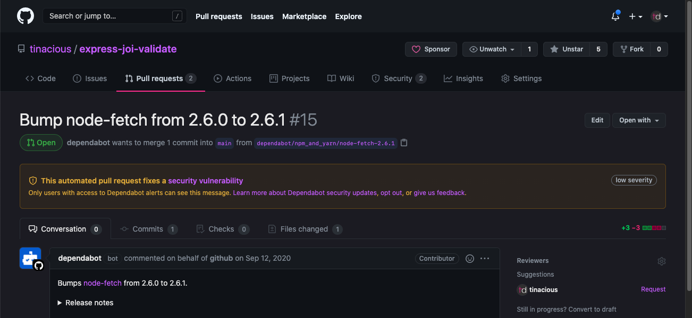
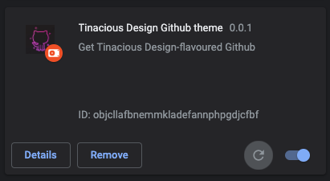

# Tinacious Design Github theme

Tinacious Design-flavoured Github theme.

Optimized for the PR process but code syntax highlighting changes apply in all code boxes in the repository.

  

## Screenshots

## Installation

1. Turn on developer mode in Chrome
2. Load this folder as an Unpacked Extension
3. Modify the source code in `content.js` to tweak it to your liking

## Attributions

- Original icon art by [syedhassan from Pngtree.com](https://pngtree.com/freepng/github-icon-design-vector_3648767.html) and modified by me
